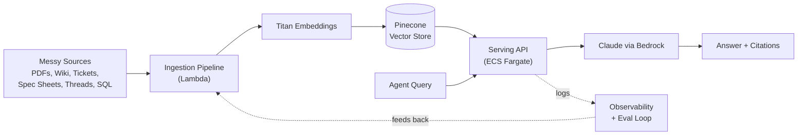
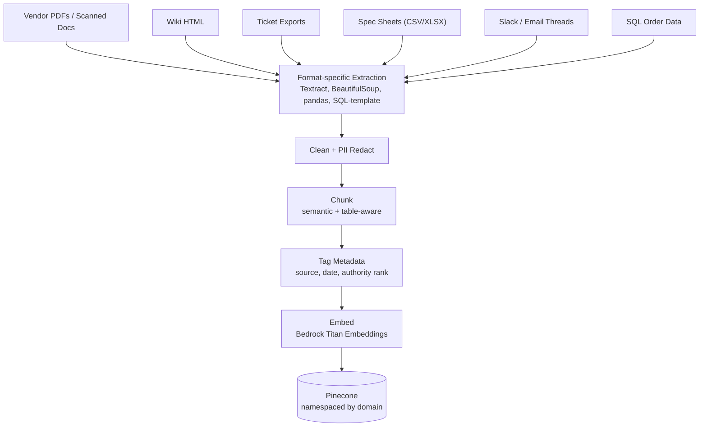
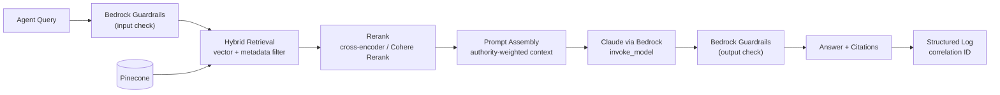
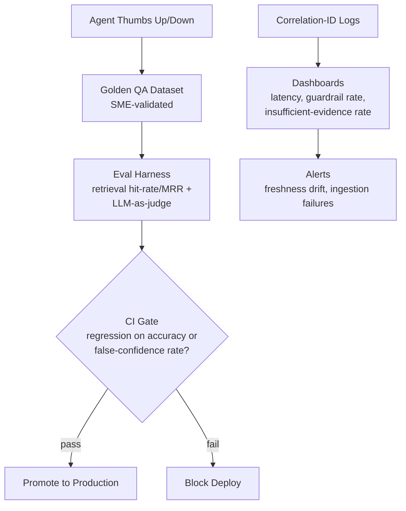

# Defending "AWS Bedrock" on the resume — reference RAG architecture

Purpose: a coherent, technically sound production RAG story consistent with
existing resume bullets (Bell Canada — "production RAG pipelines with
LangChain, OpenAI GPT-4/vector DBs Pinecone/ChromaDB," "containerized AI
inference on AWS Bedrock/Lambda/ECS," "92% retrieval accuracy"). Use this to
answer confidently, not to memorize a script word-for-word.

## System at a glance

Six main nodes to remember: **Sources → Ingestion → Embeddings → Vector
Store → Serving API → Model**, with an Observability/Eval loop wrapped
around the whole thing feeding corrections back into ingestion.

## Scenario: Ops Knowledge Copilot

An assistant for frontline network/provisioning agents that answers "why is
this stuck / what does this error mean" by retrieving across every place
that knowledge actually lives — which is never one clean source.

## The messy data problem — name the sources specifically

| Source | Format | What makes it messy |
|---|---|---|
| Vendor runbooks | PDF, some scanned | Tables, diagrams, inconsistent structure, some image-only pages needing OCR |
| Internal wiki (Confluence-style) | HTML | Nav chrome/boilerplate mixed into content, stale pages never archived |
| Ticketing system exports | Semi-structured (JSON/CSV w/ free-text fields) | Free-text resolution notes, inconsistent terminology per agent |
| Equipment spec sheets | Excel/CSV | Different schemas per vendor, merged cells, units inconsistency |
| Escalation threads (Slack/Teams/email) | Unstructured text | Noisy, multi-topic, needs summarization before it's useful context |
| Structured order/billing data | SQL tables | Not "documents" at all — needs templating into text before embedding |

The hard part was never "call an LLM." It was making six shapes of data
comparable and trustworthy enough to cite.

## Architecture — two pipelines

**Ingestion (mostly event-driven + nightly batch)**
1. Source connectors land raw files in S3 (or pull via API for tickets/DB).
2. Format-specific extraction: `unstructured`/Textract for PDFs (Textract
   specifically for scanned/OCR pages and tables), BeautifulSoup for HTML
   with boilerplate stripped, pandas for spec sheets, SQL→templated-text for
   structured order data.
3. Clean: strip nav/footer boilerplate, normalize encoding, redact PII
   before anything gets embedded.
4. Chunk: recursive/semantic chunking with overlap; tables kept intact as
   single chunks rather than split mid-row.
5. Tag metadata on every chunk: source system, doc type, last-updated date,
   and an **authority rank** (official runbook > wiki > resolved-ticket note
   > Slack thread) — this is what makes conflicting sources resolvable later.
6. Embed with **Bedrock Titan Text Embeddings**, upsert into Pinecone
   (namespaced by domain) with the metadata attached as filters.
7. Lambda handles the event-driven, low-latency ingestion triggers (new file
   dropped in S3 → embed → upsert). ECS Fargate runs the always-on retrieval
   API — that's the actual reason both show up together on the resume line.

**Serving (the request path)**
1. Query comes in → hybrid retrieval: vector similarity + metadata filters
   (e.g., restrict to "network domain," prefer higher authority rank).
2. Rerank top candidates (cross-encoder or Cohere Rerank) since a purely
   messy multi-source corpus returns a lot of near-miss chunks.
3. Prompt **Claude via Bedrock's model invocation API** with the reranked
   chunks, explicit instruction to cite sources and to defer to
   higher-authority sources on conflict, and to say "insufficient evidence"
   rather than guess when retrieval confidence is low.
4. **Bedrock Guardrails** in front of both input and output — PII filtering,
   denied-topic blocking.
5. Structured logging with a correlation ID ties the query → retrieved
   chunk IDs → final answer, so a bad answer is traceable to a bad retrieval,
   not a mystery.

## Why Bedrock specifically — the answer they're actually listening for

This is the question to expect, and it's a real, defensible answer, not a
buzzword:

- **Data never leaves the AWS network boundary** — model calls go over
  PrivateLink/VPC endpoints, nothing transits the public internet to a
  third-party API. That's the argument that matters in a regulated shop.
- **One IAM/audit model for every foundation model** — swapping Claude for
  Titan or Llama is a config change, not a new vendor integration, new
  contract, new logging pipeline.
- **Guardrails and invocation logging are native**, not something you bolt
  on yourself.
- **Procurement/compliance simplicity** — one AWS enterprise agreement
  covers model usage instead of separate vendor relationships.

## Retrieval-quality tactics worth naming

- Hybrid search (vector + metadata filter), not vector-only — pure
  similarity search over six mismatched formats surfaces too much noise.
- Authority-weighted conflict resolution baked into the prompt, not just
  the retrieval step — two sources can both be "relevant" and disagree.
- Citation-forced generation — every claim in the answer traces to a chunk
  ID, which is also what let you *measure* retrieval accuracy (the 92%
  figure on the resume = top-k retrieval hit rate against a golden eval set,
  not a vibe).

## Production hardening list

- **Observability:** correlation-ID-linked structured logs, CloudWatch
  dashboards on latency/cost/error rate.
- **Security:** VPC endpoints for Bedrock, KMS encryption at rest, least-
  privilege IAM per Lambda/ECS task role, Guardrails on both directions.
- **Cost control:** semantic caching for repeat queries, tiered model
  routing (cheap/fast model for simple lookups, escalate to a larger model
  only when retrieval confidence is low).
- **CI/CD:** GitHub Actions runs the eval suite against a golden Q&A set
  before promoting any prompt/chunking change — this is the same discipline
  as the Order Diagnosis Agent's eval harness, just applied earlier in the
  pipeline.

## Evals — in depth

Same discipline as the Order Diagnosis Agent's eval harness, applied one
layer earlier (retrieval quality, not just final diagnosis).

**Golden dataset:** curated Q&A pairs pulled from real resolved tickets,
validated by SMEs, tagged by source type so every messy-data category
(scanned PDF, wiki, spec sheet, thread) gets coverage. Deliberately include
adversarial cases: conflicting sources, stale documents, and questions with
genuinely no good answer in the corpus.

**Two layers of metrics, not one:**
- *Retrieval layer* — top-k hit rate, MRR, precision/recall against
  human-annotated "relevant chunk" labels. This is where the 92% retrieval
  accuracy figure on the resume comes from — it's a retrieval metric, not a
  generation metric, and that distinction is worth stating out loud if asked.
- *Generation layer* — LLM-as-judge grading against a rubric: factual
  correctness, citation accuracy (does the cited chunk actually support the
  claim), correct authority-source preference on conflicts, and **false-
  confidence rate** — did it fabricate an answer instead of saying
  "insufficient evidence." That last one is the same metric that caught the
  real bug on the Order Diagnosis Agent; reusing it here is a deliberate,
  tell-able pattern, not a coincidence.

**Gating, not just measuring:** the suite runs in CI on every prompt,
chunking, or embedding-model change; a regression on false-confidence rate
or retrieval accuracy blocks promotion. Evals that don't gate a deploy are
just a dashboard nobody acts on.

**Closing the loop:** thumbs up/down from agents in the UI, tied to the
same correlation ID as the log trace, feeds back into the golden dataset —
mine the false negatives real users hit, not just the ones you thought to
write test cases for.

## Observability — in depth

**Per-request trace, not just per-service logs:** every query gets a
correlation ID that threads through embedding → retrieval → rerank →
generation → guardrail check. Log the retrieved chunk IDs and scores, the
chunks that survived reranking, the exact prompt sent to Bedrock, and the
response — so a bad answer is diagnosable in one log lookup instead of a
reconstruction exercise.

**Stage-level latency, not just end-to-end:** span timing per stage
(embedding call, vector query, rerank, Bedrock invoke) surfaces which part
of the pipeline degrades, since these fail independently — a slow rerank
step looks identical to a slow model call from the outside.

**Dashboards that watch the right things:** latency percentiles (p50/p95/p99),
guardrail-intervention rate, cache hit rate, token spend, and — the one
generic dashboards miss — **rate of "insufficient evidence" responses over
time**. A sudden spike usually means an ingestion pipeline broke or a source
went stale, not that the model got worse.

**Freshness monitoring:** track the age of the source doc behind every
retrieved chunk; alert if a runbook hasn't been re-indexed past its expected
refresh window, and separately alert on ingestion pipeline failures
(Lambda errors, a dead-letter queue for embedding jobs that failed).

**Auditability angle — the one to lead with for a regulated interviewer:**
every answer is stored with the exact chunk IDs and source-doc versions that
supported it, immutable and queryable after the fact. That's what turns
"the AI said so" into something a compliance review can actually trace back
to a specific, versioned source document.

## Eval + observability loop, end to end

The nodes worth remembering: **golden dataset → eval harness → CI gate**
on one side (catches regressions before they ship), **logs → dashboards →
alerts** on the other (catches drift after it ships), and **user feedback**
closes the loop back into the golden dataset so both sides keep improving
from real traffic.

## Landmines — answer these honestly, don't overreach

- **"Did you use Bedrock Knowledge Bases / Agents?"** — if you didn't,
  say so directly: "I orchestrated retrieval myself with LangChain rather
  than the native Knowledge Bases feature — I'm familiar with what it
  offers and would evaluate it against a custom pipeline on a new project."
  A clean "no, and here's why that's fine" beats a vague dodge.
- **"Which embedding model?"** — Titan Text Embeddings is the safe, real
  answer for Bedrock; don't claim Cohere/Voyage unless that's true for you.
- **Vector store is Pinecone/ChromaDB per your resume — stay consistent.**
  Don't introduce OpenSearch Serverless in conversation unless you actually
  want to claim it.
- If a drill-down question hits something you genuinely didn't build,
  bridge honestly rather than inventing detail: name the adjacent thing you
  did do, and say how you'd approach the gap.
- **"Did you use LangSmith / Langfuse / Arize for observability?"** — if
  your real stack was CloudWatch + custom structured logging (no dedicated
  LLM-ops platform), say that plainly. Add that you're aware of those tools
  and would evaluate one if the team's scale justified it — confident about
  the gap, not defensive about it.
- **"Did Bedrock's built-in Model Evaluation feature factor in?"** — if the
  eval harness was custom-built (matching the Order Diagnosis Agent
  pattern), say so. Custom is a stronger story anyway: it shows you can
  design the metrics, not just run a managed job.
