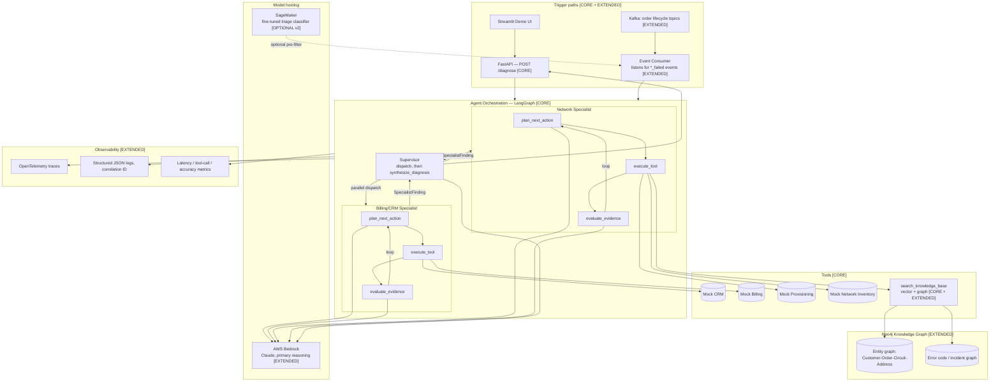

# Architecture — Order Diagnosis Agent

**Status:** Draft v2 — for discussion, not final. Depends on
[`01-REQUIREMENTS.md`](01-REQUIREMENTS.md).

**What changed from v1:** added an event-driven trigger path (Kafka), a
knowledge-graph layer (Neo4j), a model-hosting decision (Bedrock + a scoped
SageMaker role), a real observability stack, an evaluation framework
(→ [`03-EVALUATION.md`](03-EVALUATION.md)), and an explicit clean-design-
principles section. Scope is now split into **Core** and **Extended** so it
stays coherent instead of becoming a technology list — see Section 0.

## 0. Scope tiers

This project now touches a lot of technology. To keep it honest and buildable,
everything is tagged by tier:

- **[CORE]** — the minimum system that satisfies the requirements doc. Builds
  first. Everything else is meaningless without this working.
- **[EXTENDED]** — genuinely justified additions (Kafka, Neo4j, Bedrock,
  observability stack, evals) that turn this from "a working agent" into "an
  enterprise-shaped system." Builds after Core is solid.
- **[OPTIONAL / v2]** — real enterprise concerns, mentioned with honest
  reasoning, but not designed in depth or built in this project — listed so
  the scope boundary is a decision, not an oversight.

## 1. Worked example (grounds everything below in something concrete)

> **Order #ORD-88213** — customer signed up for fiber internet.
> - CRM shows the order was created successfully.
> - Billing shows payment was authorized — no hold.
> - Provisioning shows failure code `ERR_4471`.
> - The agent doesn't know what `ERR_4471` means, so it queries the
>   knowledge base: `ERR_4471` = "no circuit assigned in inventory for the
>   service address."
> - Network Inventory confirms: no circuit record exists for this address.
>
> **Diagnosis:** provisioning failed because no circuit was ever assigned to
> this address in inventory — most likely an address validation gap during
> CRM order intake, not a provisioning system fault itself.
> **Recommended action:** escalate to address validation / inventory team,
> not re-attempt provisioning (retrying won't fix a missing inventory record).

Referenced throughout — including in the new event-driven and graph sections.

## 2. High-level architecture



## 3. Core agent design [CORE]

**Updated to a multi-agent design (Section 3.8) after review — the mechanics
in 3.1-3.7 below now describe what runs *inside* the supervisor and each
specialist, not one flat agent.** Kept 3.1-3.7 in their original numbering
and appended 3.8 rather than restructuring, specifically to avoid
reintroducing the cross-reference drift bugs found in the last review pass.

### 3.1 Why LangGraph, explicit graph instead of `create_agent`

`16Langchain-Deep-Interview.ipynb` covered `create_agent` (LangGraph's prebuilt
ReAct wrapper) — the simple case. This project builds the graph **explicitly**
for two real reasons:

1. **The evidence-sufficiency check is a genuine architectural decision.**
   `evaluate_evidence` is its own node because "do I have enough to diagnose
   confidently" is a different judgment than "what should I check next" —
   worth separating so each prompt has one clear job.
2. **A human-in-the-loop review point is a realistic future requirement.**
   The requirements doc's scope boundary says no corrective action in v1 —
   but a v2 with any write capability would need an approval gate before any
   write. LangGraph's `interrupt()` is built exactly for "pause, wait for
   human approval, continue." Not built in v1, but the explicit graph is what
   makes that extension possible without a redesign.

### 3.2 Agent state

**Superseded by the Section 3.8 multi-agent redesign — this is now two
distinct state types, not one flat state.** The original single
`DiagnosisState` with one global `MAX_ITERATIONS` no longer matches the
architecture once there are 3 separate loops (2 specialists + the
supervisor), so it's corrected here rather than left stale:

```python
class SpecialistState(TypedDict):
    order_id: str
    evidence: list[ToolResult]
    iterations: int

SPECIALIST_MAX_ITERATIONS = 3  # each specialist owns only 2-3 tools
                                # (Section 3.8) — this replaces the old
                                # flat MAX_ITERATIONS = 6, which was sized
                                # for a single 4-hop loop that no longer
                                # exists in this form

class SupervisorState(TypedDict):
    order_id: str
    billing_finding: SpecialistFinding | None
    network_finding: SpecialistFinding | None
    diagnosis: DiagnosisOutput | None
```

**Decision, stated explicitly rather than left ambiguous:** the supervisor
does **not** loop in v1 — it's a single dispatch → both specialists return
→ synthesize pass, not iterative. If that single pass isn't enough to
diagnose confidently (including the Section 3.7 unresolved-conflict case),
the correct outcome is `insufficient_evidence=True`, not a supervisor retry
loop. A supervisor-level loop (e.g., re-engaging a specialist with a more
targeted follow-up question) is a real, reasonable future capability —
deliberately **not** built in v1, consistent with keeping Core's scope
honest rather than open-ended.

### 3.3 Tools

| Tool | Input | Returns | Backed by | Owned by (Section 3.8) |
|---|---|---|---|---|
| `get_order_record` | `order_id` | CRM order status, customer ID, service type | Mock CRM | Billing/CRM specialist |
| `get_billing_status` | `customer_id` | Payment status, holds, plan | Mock Billing | Billing/CRM specialist |
| `get_provisioning_log` | `order_id` | Provisioning status, error codes | Mock Provisioning | Network specialist |
| `get_inventory_status` | `address`/`circuit_id` | Circuit/resource assignment | Mock Network Inventory | Network specialist |
| `search_knowledge_base` | free-text query | Top-k relevant docs/graph facts, with citation | Chroma (vector) + Neo4j (graph) — see Section 5 | Network specialist |

**On mocking CRM/Billing/Provisioning/Inventory:** confirmed — these stay
fully mocked. They're realistic FastAPI services with seeded synthetic data
(schemas, latency, occasional error responses), not real integrations. No
value in hand-building 4 production-grade backend systems for a portfolio
project whose actual point is the *agent*, not the systems it queries.

**This is genuine microservices architecture, not a monolith pretending to
be one:** each mock system (CRM, Billing, Provisioning, Inventory) runs as
its own independently deployable FastAPI service — own process, own port,
own container (`Section 10`'s Docker Compose setup), with its own seeded
data. The agent calls them **only over HTTP**, never via direct Python
import — that boundary is what makes the "5th backend system = 1 new tool,
no agent redesign" extensibility claim (NFR table) actually true, not just
aspirational. Same principle as the interface-based mock/real boundary in
Section 8, applied at the deployment level, not just the code level.

### 3.4 Structured output

```python
CONFIDENCE_ORDER = {"low": 0, "medium": 1, "high": 2}  # explicit ordinal
                                                         # mapping — needed
                                                         # so "at least
                                                         # medium confidence"
                                                         # is a real,
                                                         # comparable check,
                                                         # not just a label

class DiagnosisOutput(BaseModel):
    root_cause: str
    confidence: Literal["low", "medium", "high"]
    evidence: list[str]
    recommended_action: str
    insufficient_evidence: bool

    @model_validator(mode="after")
    def confidence_matches_evidence_state(self):
        # Invariant, enforced by construction, not convention: an
        # "insufficient evidence" diagnosis can never simultaneously claim
        # high or medium confidence — the two would directly contradict
        # each other, and this must be impossible to construct, not just
        # discouraged by prompt instructions. Same pattern as the
        # @field_validator work from Day 3's FastAPI project, applied here
        # to a cross-field invariant instead of a single field.
        if self.insufficient_evidence and self.confidence != "low":
            raise ValueError(
                "insufficient_evidence=True requires confidence='low' — "
                "cannot report insufficient evidence with non-low confidence"
            )
        return self
```

### 3.5 Parallel tool dispatch — resolves the latency/NFR contradiction

**The problem this fixes:** the original design called exactly one tool per
loop iteration, strictly sequentially. Against the NFR's "single-digit
seconds" target and the decision to simulate realistic tool latency, up to
`MAX_ITERATIONS = 6` sequential round-trips could blow well past that budget
— the NFR asked for parallelizable calls, but nothing in the design actually
was parallel.

**The fix:** `plan_next_action` isn't limited to choosing one tool — using
the same multi-tool-call capability shown with `bind_tools` in
`16Langchain-Deep-Interview.ipynb` (a single model response can request
several tool calls at once), it can request every tool whose inputs are
already available in the current evidence, in one planning round.
`execute_tool` then dispatches all of them **concurrently** (`asyncio.gather`),
and every result lands in `evidence` together before the next
`evaluate_evidence` check.

**Why `asyncio`, not `threading` or `multiprocessing` — stated explicitly,
since this is a real interview question, not just an implementation detail:**
this is I/O-bound work — every tool call is waiting on a network response
from a mock HTTP service (or the OpenAI/Bedrock API for `search_knowledge_base`),
not doing CPU-heavy computation. That rules out `multiprocessing`: spinning up
separate OS processes to *wait on network calls* is pure overhead with no
payoff, since there's no CPU-bound work to actually parallelize across cores.
`threading` would technically work (Python releases the GIL during I/O
waits), but `asyncio` is the more idiomatic choice here specifically because
FastAPI's request handlers are already `async def` — using `asyncio.gather`
inside an already-async request handler is a single coherent concurrency
model end-to-end, instead of mixing threads into an async codebase (which
introduces real complexity: thread-safety concerns for anything shared across
the boundary, needing `run_in_executor` to bridge sync and async code). The
GIL is why this reasoning matters at all: for CPU-bound work, `threading`
wouldn't actually parallelize in Python and `multiprocessing` would be the
correct answer instead — this project just isn't that kind of workload.

Applied to the worked example (`ORD-88213`), given the data-model dependency
chain from `01-REQUIREMENTS.md` Section 9:
- **Round 1** (parallel): `get_order_record(order_id)` and
  `get_provisioning_log(order_id)` — both need only `order_id`, which is
  known up front. No dependency between them.
- **Round 2** (parallel): `get_billing_status(customer_id)` (now available
  from Round 1's CRM result) and `search_knowledge_base(error_code)` (now
  available from Round 1's provisioning result).
- **Round 3**: `get_inventory_status(address/circuit_id)`, once the KB
  lookup or provisioning result has resolved what to check.

Three rounds, not four sequential calls — and each round's calls happen
concurrently, not back-to-back. `iterations` in `SpecialistState` (Section
3.2) counts **planning rounds**, not individual tool calls —
`SPECIALIST_MAX_ITERATIONS = 3` gives headroom above this 2-3-round pattern
per specialist.

### 3.6 Retry and failure handling for tool calls

Directly needed by the decision (Section 11) that mocks simulate transient
failures — that decision is meaningless without a stated rule for what
happens next:

- A transient tool failure is retried **once**, with a short fixed backoff.
  Not a full circuit-breaker/exponential-backoff policy — that's a real v2
  concern (`Section 10`), out of proportion for this project's actual point.
- If the retry also fails, the failure is recorded **explicitly** in
  `evidence` as an "unavailable" result — never silently dropped. A system
  being unreachable is itself diagnostic information (e.g., "Provisioning
  system unreachable, cannot confirm circuit status" is a legitimate
  contributor to an `insufficient_evidence=True` outcome under FR6), not a
  gap the agent should quietly work around.

### 3.7 Conflicting evidence handling

FR2 covers correlating evidence across systems, but not what happens when
two systems' evidence appears to **disagree** — a real gap, not just a
missing golden scenario (added to `03-EVALUATION.md`'s archetype list below).

- `evaluate_evidence` must explicitly name a detected conflict as part of
  its reasoning — never silently pick a side without surfacing that a
  conflict existed.
- **Precedence rule:** for technical failure diagnosis, Provisioning and
  Network Inventory (systems reflecting actual technical state) take
  precedence over CRM and Billing (systems reflecting administrative/
  customer-facing records) when they conflict. This rule is stated
  explicitly here so it's an auditable design decision, not an implicit
  bias buried in a prompt.
- If the conflict can't be resolved by that precedence rule (e.g., two
  technical systems disagree with each other), `synthesize_diagnosis` must
  fall back to `insufficient_evidence=True`, naming the specific conflict
  as the reason — consistent with FR6, extended to cover "evidence
  disagrees" as its own trigger, not just "evidence is missing."

**A separate, previously unhandled case: multiple independently *true*
causes, not a conflict.** The precedence rule above resolves *contradictory*
evidence (systems disagree). It doesn't apply when two systems report real,
non-contradictory problems at the same time (e.g. a genuine billing hold
*and* a genuine provisioning failure, both actually true — `03-EVALUATION.md`'s
"multiple plausible causes" archetype). `DiagnosisOutput.root_cause` is a
single string, so `synthesize_diagnosis` needs its own rule here, decided
explicitly rather than left to guesswork:

- **Pipeline-order rule:** report whichever real failure occurs **earliest**
  in the order the order actually flows through — `CRM → Billing →
  Provisioning → Inventory`. Reasoning: the earliest blocker is the one
  actually preventing progress; a later-stage issue may not even matter
  until the earlier one is resolved (a provisioning error is moot if the
  order can't proceed past an unpaid billing hold in the first place).
- All genuinely-true findings still appear in `evidence` (auditability, FR5)
  even when only one becomes `root_cause`/`recommended_action` — nothing
  gets silently dropped, it's just not what the agent leads with.
- This is a distinct rule from the conflict-precedence rule above:
  conflict-precedence picks a *side* when evidence disagrees; the pipeline-
  order rule picks a *priority* when evidence agrees but there's more than
  one real problem.

### 3.8 Multi-agent redesign: supervisor + 2 specialists [CORE]

**Why this belongs in Core, not Extended:** unlike Kafka/Neo4j (genuinely
optional enrichments), the specialist split changes the shape of the core
reasoning itself — bolting it on later would mean rewriting Sections 3.1-3.7,
not adding a layer on top of them. It's decided now, as part of Core.

**The domain split, and why it's real, not arbitrary:**

| Specialist | Owns | Mirrors |
|---|---|---|
| Billing/CRM specialist | `get_order_record`, `get_billing_status` | A telecom's account/billing support team |
| Network specialist | `get_provisioning_log`, `get_inventory_status`, `search_knowledge_base` | A telecom's NOC/network operations team |

**The critical design constraint (avoiding the classic multi-agent failure
mode):** each specialist returns a `SpecialistFinding` — full structured
evidence, not a prose summary:

```python
class SpecialistFinding(BaseModel):
    specialist: Literal["billing_crm", "network"]
    evidence: list[ToolResult]       # everything the specialist gathered,
                                      # raw, not condensed
    preliminary_assessment: str      # the specialist's own read, offered
                                      # as a hint, never authoritative
```

If specialists instead returned only a text summary, the supervisor's
conflict-resolution logic (Section 3.7, FR9) would be working from
already-lossy information — exactly the failure mode that makes naive
multi-agent splits worse than a single agent, not better. Passing the full
`evidence` list up is what makes this split safe.

**Flow:**

1. **Supervisor** receives `order_id`, dispatches to **both** specialists
   in parallel immediately — both specialists' first tool calls need only
   `order_id` (same reasoning as Section 3.5's Round 1, now applied at
   agent granularity instead of tool granularity).
2. Each specialist runs its **own** scoped version of the Section 3.1-3.6
   loop (`plan_next_action` → `execute_tool` → `evaluate_evidence`), bounded
   by its own smaller `MAX_ITERATIONS` (3 each — sized to its 2-3 tools,
   not the full 6), and returns a `SpecialistFinding`.
3. **Supervisor** receives both findings, applies Section 3.7's conflict
   detection/precedence rule directly against the raw evidence in both
   findings (not the `preliminary_assessment` text), and runs
   `synthesize_diagnosis` to produce the final `DiagnosisOutput`.

**LangGraph mechanism:** each specialist is its own compiled LangGraph graph,
invoked as a node inside the supervisor's graph (LangGraph's documented
subgraph-as-node pattern) — not three unrelated systems glued together with
custom code.

**What did NOT change:** FR1 (agent decides which systems to query, not a
fixed script) still holds — the supervisor could choose to engage only one
specialist if the triggering event already makes the domain obvious (e.g., a
`billing_hold_applied` event might not need the Network specialist at all),
rather than always running both. Engaging both by default (step 1 above) is
the general case; a smarter supervisor triage step is a reasonable Extended
enhancement, not required for Core.

## 4. Event-driven trigger path [EXTENDED]

### Why this is a genuine architectural addition, not decoration

Real order-management systems are naturally event-driven — every state
transition (`order.created`, `order.payment_authorized`,
`order.provisioning_failed`, ...) is something a system would actually
publish. Right now the only trigger is a human calling `POST /diagnose` —
purely **reactive**. Adding Kafka changes the trigger model to **proactive**:
the moment a `provisioning_failed` event lands, diagnosis starts automatically,
before a human even notices there's a problem.

### Design

- **Topics:** `order.created`, `order.payment_authorized`,
  `order.provisioning_failed`, `order.provisioning_succeeded`,
  `order.billing_hold_applied` — the mock backend services publish these as
  they process (a mock CRM "creating" an order also emits `order.created`).
- **Event consumer:** a lightweight service subscribed to the `*_failed` /
  `*_hold_applied` topics. On a matching event, it invokes the same LangGraph
  agent used by the FastAPI path — **one agent core, two trigger paths**, not
  two separate implementations.
- **Audit events:** every tool call and diagnosis decision is *also*
  published to a `diagnosis.events` topic — decouples logging/observability
  consumers from the agent's critical path (Section 7 subscribes to this,
  doesn't block on it).

### What this deliberately does NOT do (still respecting the no-write
scope boundary)

The agent still never writes back to CRM/Billing/Provisioning — the event
path only changes *when* diagnosis runs (proactively vs. on-demand), not
*what* the agent is allowed to do once it runs.

## 5. Knowledge graph layer — Neo4j [EXTENDED]

### Why this is a genuine fit, not a resume-line addition

Two real, separate use cases, both because the underlying data is naturally
graph-shaped:

**5.1 Entity relationship graph.** The cross-system join problem
(`01-REQUIREMENTS.md` Section 9: `order_id` → `customer_id` → `circuit_id`
→ `address`, discovered progressively across 4 systems) is literally a
graph traversal
problem. Modeling it explicitly in Neo4j —

```
(:Customer)-[:PLACED]->(:Order)-[:REQUIRES]->(:Circuit)-[:ASSIGNED_TO]->(:Address)
(:Order)-[:HAS_STATUS]->(:ProvisioningState)
```

— lets a query like "find every order affected by circuits tied to this
address" become one Cypher traversal instead of manually joining 4 REST
responses in application code. This mirrors how real telecom network
topology is often modeled (a "digital twin" graph of physical/logical
network resources), not an artificial addition.

**5.2 GraphRAG for the knowledge base.** Plain vector search (Chroma) finds
*semantically similar* text. A graph additionally captures *documented
relationships* — `ERR_4471` --[CAUSED_BY]--> "missing circuit assignment"
--[RESOLVED_BY]--> "escalate to address validation" --[RELATED_INCIDENT]-->
past ticket #4821. `search_knowledge_base` (Section 3.3) queries **both**:
vector similarity for "what does this error code generally mean," graph
traversal for "what specific resolution path and related incidents does it
connect to." This is a genuinely more advanced retrieval pattern than pure
vector RAG, worth demonstrating deliberately rather than defaulting to
vector-only because that's what Days 13-14 already built.

**Real infrastructure reuse, not new tooling for its own sake:** this reuses
the actual Neo4j Aura instance and `python/neo4j_for_adk.py` connection
pattern already built and verified working during the Agentic Knowledge
Graph Construction coursework — not a new dependency introduced just for
this project.

## 6. Model hosting: Bedrock + a scoped role for SageMaker [EXTENDED / OPTIONAL]

### Bedrock — primary, [EXTENDED]

**Recommendation: Amazon Bedrock for the agent's core reasoning (Claude).**
Bedrock is AWS's managed layer for calling foundation models — same role the
Anthropic API plays directly today, just fronted by AWS (IAM-based auth,
region control, and — genuinely relevant given Section 10's PII concerns —
**Bedrock Guardrails** for built-in content/PII filtering). Reasoning: this
project's core problem is orchestrating tool calls and reasoning over
evidence, not training or hosting a custom model — that's exactly the
problem Bedrock is built for, and SageMaker is not.

### SageMaker — scoped, [OPTIONAL / v2]

**Not for the core reasoning model.** SageMaker is for training/hosting your
*own* models — the right fit here is narrow and specific: a small **fine-
tuned triage classifier** sitting in front of the expensive LangGraph agent.
Most incoming events (Section 4) are probably simple, common failure
patterns; a fast, cheap classifier could route the obvious cases to a
templated response and reserve the full multi-tool reasoning agent for
genuinely ambiguous cases. This is a real enterprise cost-optimization
pattern (cheap model filters, expensive model only when needed) — and it
directly reuses the fine-tuning skills from the existing bonus Project 6,
rather than introducing SageMaker for an unrelated reason. Marked
**optional/v2** because it's a genuine scope addition requiring its own
labeled training data, not because it's a weak idea.

## 7. Observability [EXTENDED]

Three distinct concerns, deliberately not conflated:

| Concern | Mechanism | Answers |
|---|---|---|
| **Distributed tracing** | OpenTelemetry, one trace per diagnosis request, spans per tool call + per LangGraph node | "What did the agent actually do, in what order, how long did each step take?" |
| **Structured logs** | JSON logs (Python `structlog` or stdlib `logging` + JSON formatter), every log line carries a `correlation_id` = the diagnosis request ID | "Show me everything related to this one diagnosis, across every service" |
| **Metrics** | Latency histograms per node, tool-call counts, `insufficient_evidence` rate, confidence distribution | "Is the system healthy in aggregate, over time?" |

This directly upgrades the v1 "flat JSONL audit log" into a real 3-part
observability stack — tracing for *what happened in one request*, logs for
*searchable detail*, metrics for *aggregate health*. All three correlate via
the same `correlation_id`/`trace_id`.

## 8. Clean design principles [CORE — applies throughout]

Not a separate component, a set of tenets the whole codebase follows:

- **Interface-based mock/real boundary.** Each backend "system" (CRM,
  Billing, ...) is called through a small interface (e.g. `CRMClient`
  protocol); the mock implementation satisfies it today, a real
  implementation could satisfy it later without touching the agent code.
- **Dependency injection for tools.** The agent graph receives its tools as
  a parameter, not hardcoded imports — makes the graph testable with fake
  tools in isolation from real (or mock) service calls.
- **Type safety end-to-end.** Pydantic models for every tool input/output and
  the final diagnosis — no loosely-typed dicts passed between components.
- **12-factor config.** All service URLs, model names, and thresholds (max
  iterations, confidence cutoffs) come from environment config, never
  hardcoded — same discipline as `.env` usage throughout this whole
  curriculum, just formalized.
- **Single agent core, multiple trigger paths.** Section 4's event path and
  the FastAPI path both call the same LangGraph graph — no duplicated logic
  between "sync mode" and "async mode."
- **Why FastAPI, not Django/Flask — a real mismatch, not a style
  preference.** Two of the principles just above depend on it directly:
  async is load-bearing (Section 3.5's `asyncio.gather` tool dispatch needs
  native `async def` handlers — Flask's/Django's async support is
  retrofitted, not foundational), and "type safety end-to-end" already
  means Pydantic models everywhere (`DiagnosisOutput`, `ToolResult`,
  `SpecialistFinding`) — FastAPI validates against those same models
  natively, where Flask needs an add-on and Django REST Framework brings
  its own separate serializer system, meaning two parallel validation
  layers for no benefit. Django's actual strengths (ORM, admin panel,
  server-rendered templating) don't apply here either — mock services use
  plain SQLite by design (Section 12), and the demo UI is Streamlit, not
  server-rendered pages.

## 9. Evaluation

Split into its own document — see [`03-EVALUATION.md`](03-EVALUATION.md).
Not an afterthought: FR6 (must say "insufficient evidence" rather than
fabricate) and the false-confidence-rate metric only mean anything if there's
a real evaluation harness checking them.

## 10. Further enterprise considerations — named, not designed [OPTIONAL / v2]

Real concerns worth naming honestly as deliberately out of scope, rather than
silently ignored:

- **Guardrails / PII redaction** beyond what Bedrock Guardrails provides
  out of the box — telecom order data includes real customer PII (address,
  account info); a production system would need an explicit redaction layer
  before any data reaches logs or traces.
- **Semantic response caching** — repeated/similar diagnosis requests could
  skip the LLM entirely; not built here since the mock data doesn't have
  enough volume to make caching interesting to demonstrate.
- **CI/CD with eval-gated deploys** — the eval suite (`03-EVALUATION.md`)
  should block a deploy if accuracy regresses; real value, but a CI pipeline
  is infrastructure this project doesn't need to stand up to make the point.
- **Containerization / IaC** — Docker Compose for local dev (mock services +
  Chroma + agent) is reasonable to build; Kubernetes/Terraform for "real"
  deployment is named but not designed — genuinely enterprise concerns, but
  orthogonal to the AI engineering skills this project exists to demonstrate.
- ~~API authentication / rate limiting on `POST /diagnose`~~ — **resolved,
  no longer belongs in this "not designed" list.** Pulled into Core per
  this section's own earlier note that it was cheap to build — implemented
  in `04-BUILD-PLAN.md` Phase 5 (API-key auth + `slowapi` rate limiting).
  Left here, struck through, so the decision history isn't lost.
- ~~API Gateway pattern~~ — **moved out of this list, now actually designed**
  — see Section 14. Pairs naturally with the Bedrock migration (both are
  "move the ingress/hosting layer to AWS-managed" work), and it's cheap to
  add on top of a system already going AWS-native for model hosting.
- **CAP theorem tradeoffs** — genuinely not engaged with anywhere in this
  doc, worth naming rather than pretending it doesn't apply. The one place
  it would actually matter: **Kafka's replication/acknowledgment settings**
  (`acks=0/1/all`, in-sync replica count) are a real availability-vs-
  consistency tradeoff during a broker failure — not designed here, since
  Phase 9's single-broker KRaft setup has no replication to tune in the
  first place. Every data store in this project (SQLite-per-service, a
  single Neo4j Aura instance, local Chroma) is single-node by choice
  (Section 12), so there's no distributed-consistency tradeoff actually
  being made at this scale — CAP becomes a real design question only if
  any of these moved to a genuinely distributed/multi-region deployment,
  which is out of scope here.
- **Consistent hashing** — has **no natural home in this architecture**,
  honestly, not just unaddressed. It solves rebalancing data/load across
  nodes as they're added/removed — relevant to sharded databases,
  distributed caches, or partition assignment. Nothing here is sharded:
  every data store is single-node (see CAP note above). The one place a
  hashing-based assignment mechanism exists at all is Kafka's own
  consumer-group partition rebalancing (Phase 9) — but that's handled
  internally by Kafka's consumer group protocol, not something this
  project implements by hand. Forcing consistent hashing into this design
  would be solving a problem this system doesn't have.

## 11. Decisions (resolved)

- **Confidence scoring: categorical** (`low`/`medium`/`high`) — already
  reflected in `DiagnosisOutput` (Section 3.4).
- **Max iterations: originally reasoned as "6" against a single flat loop
  — superseded by Section 3.2/3.8's multi-agent split.** The original
  reasoning (raised from "2" to "6" so `ORD-88213`'s 4 tool calls could
  complete) is still the right instinct, but the number now applies
  differently: each **specialist** is capped at `SPECIALIST_MAX_ITERATIONS
  = 3` (Section 3.2), sized to its own 2-3 tools, and the **supervisor**
  doesn't loop at all in v1 (single dispatch → synthesize pass, Section
  3.2). Recorded here so the history of the decision isn't lost, even
  though the concrete number moved when the architecture did.
- **Mock services simulate realistic latency and transient failures**
  (not instant, always-succeed responses). This matters for two things
  this project is actually trying to demonstrate: the p95 latency metric
  (`03-EVALUATION.md`) is meaningless against instant mocks, and a
  transient-failure path is what actually exercises the "insufficient
  evidence" behavior (FR6) realistically — a tool that times out or
  returns malformed data is a different case than a tool that cleanly
  returns "no data," and a real system has to handle both.
- **Local dev sequencing: stub first, wire in real Neo4j Aura + real Kafka
  (Docker) once Core is proven.** Build and validate the `[CORE]` agent
  (LangGraph orchestration + the 4 mock backend systems + a Chroma-only
  knowledge-base tool) completely first, behind the same interface-based
  boundaries already committed to in Section 8 — a fake in-memory graph
  store and a fake in-memory event queue satisfy those interfaces initially.
  Once Core's agent logic is proven and passing the eval suite
  (`03-EVALUATION.md`), swap in the real Neo4j Aura connection
  (`neo4j_for_adk.py`, already built and verified working) and a real
  Kafka broker via Docker for the `[EXTENDED]` layer. Reasoning: this
  isolates "does the agent's reasoning work" from "is the infrastructure
  wired correctly" — debugging both at once, from day one, means every bug
  is ambiguous about which layer it's actually in. It also matches the
  Core → Extended build order already established in Section 0.

## 12. Backend data stores

Genuinely unspecified until now — every component that needs to persist
data, and what actually backs it. Same Core (simple/local) → Extended
(production-equivalent, named) discipline as everywhere else in this doc.

| Component | Core [CORE] | Extended / production-equivalent [EXTENDED, named] |
|---|---|---|
| Mock CRM / Billing / Provisioning / Inventory | **One SQLite file per service** — "database per service," not one shared DB across all 4. A shared DB across microservices is a real anti-pattern (it re-couples services the HTTP boundary was meant to decouple) — worth avoiding even at mock scale, since the whole point of Section 3.3's microservices note is that the boundary is real. | Separate managed DB per service (e.g., its own RDS/Aurora instance) — named, not built; the mock services don't need production-grade DBs to make the architectural point. |
| Knowledge base — vector store | **Chroma**, local — same tool as Days 13-14 | **Pinecone** — already the established production answer from Day 14's own lesson, not a new decision |
| Knowledge base — graph store | **Neo4j Aura** — already real and cloud-hosted (Section 5); no separate "Extended" tier needed here, it already is one | — |
| LangGraph agent state (checkpointing) | **SQLite checkpointer** (`langgraph-checkpoint-sqlite`) — needed for the `interrupt()`-readiness commitment in Section 3.1 to mean anything concrete: a paused graph has to persist its state *somewhere* to be resumable | **Postgres checkpointer** (`langgraph-checkpoint-postgres`) — same interface, swapped backend |
| Audit log / structured logs | **Local JSON Lines file** (or a SQLite table, for queryability) | Centralized log store (CloudWatch / Loki / Elasticsearch) — named, not built |
| Metrics | In-process counters exposed at a `/metrics` endpoint, Prometheus text format | Real Prometheus + Grafana — named, not built |
| Traces | OpenTelemetry SDK, exported to local console/file | Real trace backend (Jaeger / Tempo / LangSmith) — named, not built |
| Golden evaluation dataset (`03-EVALUATION.md`) | Versioned JSON fixture file — it's a fixed test set, not runtime data, so it doesn't need a database at all | Same — no production-scale reason to change this |
| API ingress: auth + rate limiting | In-app — FastAPI `Depends(verify_api_key)` + `slowapi` (Phase 5) | **Amazon API Gateway** (HTTP API type) — native API keys + usage-plan throttling, ahead of the app (Section 14) |

**Why SQLite shows up so often at Core:** consistent, deliberate choice —
zero operational overhead for local dev/demo, while still being a real
relational database (not an in-memory dict pretending to be one), so the
Extended-tier swap to Postgres/RDS is a connection-string change, not a
rewrite. This is the same "interface-based boundary" principle from Section
8, applied to storage instead of service calls.

## 13. Testing strategy [CORE]

Section 8 named dependency injection as making the graph "testable," but
never actually said how — a real gap, since "how would you test this" is as
common an interview question as the architecture itself. Three distinct
layers, each needing a different approach:

| Layer | What's tested | How |
|---|---|---|
| **Tool functions** (`get_order_record`, etc.) | Correct HTTP call shape, correct parsing of the mock service's response | Unit tests against the *real* mock FastAPI services (not further-mocked) — since the mock services are already fast, local, and deterministic, there's no need for a second layer of mocking on top of them |
| **Specialist nodes** (`plan_next_action`, `evaluate_evidence`) | Does the node make the right *decision* given a specific evidence state, independent of which tool implementation is wired in | Unit tests with **fake tools** (plain Python functions returning canned data) injected via the Section 8 DI pattern — the concrete payoff of that design principle |
| **Supervisor node** (`synthesize_diagnosis`) | Conflict detection/precedence (Section 3.7), the multi-cause pipeline-order rule (FR10), and the `confidence`/`insufficient_evidence` invariant (Section 3.4) — **not** tool behavior, this node never calls a tool | Unit tests that construct a `SupervisorState` **directly**, with hand-crafted `SpecialistFinding` objects (bypassing `dispatch_specialists` and both specialist subgraphs entirely), then call `synthesize_diagnosis` alone. This is what actually makes the supervisor's decision logic testable in isolation — running the full stack end-to-end would test integration, not this logic specifically |
| **Full specialist / supervisor graphs** | End-to-end behavior for one scenario — does the whole loop converge to the right `DiagnosisOutput` | The golden dataset itself (`03-EVALUATION.md`) *is* this layer — integration tests and evals are the same suite here, not two separate things to maintain |

**Test isolation for the LLM calls specifically:** unit tests for
`plan_next_action`/`evaluate_evidence` don't call the real model — they
assert on **prompt construction** (given this evidence state, is the right
information actually in the prompt?) separately from **response handling**
(given this model response, does the node parse/act on it correctly). The
golden-dataset evals (which do call the real model) are what actually
validates end-to-end reasoning quality — deliberately not conflated with
fast, deterministic unit tests that would otherwise become flaky and slow
for no benefit.

**Framework:** `pytest`, consistent with no new tooling decision needed —
standard choice, not a differentiator worth deep design discussion here.

**Coverage:** `pytest-cov`, run via `pytest --cov=agent --cov=api --cov=eval --cov=graph`
(grew from `agent`/`api` alone as `eval/` and `graph/` were built in
Phases 6/8). Scoped to those specifically — not `mock_services/`, which is
intentionally simple CRUD wrappers around a schema, not the part of the
system whose correctness this project is actually about. Within that
scope, two kinds of file are expected to sit well under 100% and that's
fine, not a gap: orchestration scripts meant to be run directly and
verified by their own real output (`eval/run_eval.py`'s printed metrics
report, `graph/populate.py`'s real graph content) rather than exercised
line-by-line in a unit test, and vendored utility modules
(`graph/neo4j_for_adk.py`) verified by using them for real rather than
re-testing code that already works. **Reported, not gated** — no enforced
percentage threshold, since chasing a number (e.g. 100%) is a vanity
metric that doesn't mean correct behavior, the same "illustrative, not a
production claim" honesty already applied to the eval metrics
(`03-EVALUATION.md` Section 5). A CI gate enforcing a coverage floor is
exactly the kind of thing Section 10's named-not-built
"CI/CD with eval-gated deploys" item would eventually wrap this into — not
built here, same reasoning as everywhere else that item applies.

## 14. API Gateway — ingress layer [EXTENDED]

**What changes, and what doesn't:** Core's `POST /diagnose` (Phase 5) has
auth (API key check) and rate limiting built directly into the FastAPI app
itself — the right call for local dev, where there's no AWS deployment to
front yet. At Extended, once the system is actually deployed to AWS
alongside Bedrock (Section 6, Phase 11), **Amazon API Gateway** takes over
those two concerns at the ingress layer, ahead of the application:

- **Auth** — API Gateway's native API keys + usage plans replace the
  in-app `X-API-Key` header check. One fewer piece of security logic living
  inside application code.
- **Rate limiting / throttling** — API Gateway's built-in throttling
  (requests-per-second + burst limits, per usage plan) replaces the
  in-app `slowapi` limiter from Phase 5.
- **What does NOT change:** the actual diagnosis logic. API Gateway is
  purely an ingress concern — it sits in front of the FastAPI app and
  forwards authenticated, rate-limit-passed requests through; the
  supervisor/specialist/tool logic underneath is completely unaware it
  exists. Same principle as Bedrock (Section 6): swap the outer layer,
  core reasoning untouched.

**Type:** **HTTP API**, not REST API — this project has one route
(`POST /diagnose`) with no need for REST API's request/response
transformation mapping templates or resource-based policies; HTTP API is
cheaper and simpler, and covers everything actually needed here.

**Scope boundary, stated deliberately:** this section designs the gateway's
own role (auth, throttling, routing to the app) — it does **not** design
the underlying compute topology the gateway forwards to (Lambda vs.
ECS/Fargate vs. a plain EC2-hosted container). That's the same
containerization/deployment-topology question Section 10 already named as
out of scope (Docker Compose locally, Kubernetes/Terraform named but not
designed) — API Gateway's target is "wherever the FastAPI app ends up
running," not a new decision about what that is.

**Testing implication, stated explicitly so coverage doesn't look like it
silently vanished:** API Gateway's own auth/throttling behavior is
AWS-managed infrastructure — not something this project unit-tests itself,
the same way DNS or a load balancer's TCP handling wouldn't be. `Phase 5`'s
`tests/test_api.py` (`TestClient`-based, no AWS involved) keeps validating
the actual application logic underneath; verifying the deployed gateway's
config is a manual/deployment-time check, not part of the pytest suite.
